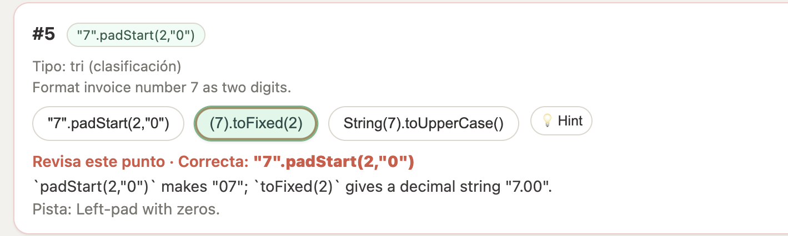

# Informe de revisión — Ítems a reforzar

Total: 25 · Correctos: 19 · A revisar: 6

### FMT-01 · Respuesta corta (short)

**Question:** What does the console print?

**Tu respuesta:** 2.00

**Estado:** ❌ Incorrecta · **Correcta:** 2.01

**Explicación**

IEEE rounding: 2.005 rounds to "2.01" with two decimals (string).

> 💡 *Pista:* `toFixed` rounds and returns a string.


**JS**

```js
console.log(2.005.toFixed(2));
```

### FMT-03 · Respuesta corta (short)

**Question:** What does the console print (Spanish formatting, fixed 2 decimals)?

**Tu respuesta:** 1234.50

**Estado:** ❌ Incorrecta · **Correcta:** 1.234,50

**Explicación**

`toLocaleString("es-ES")` formats with thousands as dots and decimals as commas.

> 💡 *Pista:* Spain: dot thousands, comma decimals.


**JS**

```js
console.log((1234.5).toLocaleString("es-ES",{minimumFractionDigits:2,maximumFractionDigits:2}));
```

### FMT-05 · Clasificación (tri)

**Question:** Format invoice number 7 as two digits.

**Tu selección:** (7).toFixed(2)

**Estado:** ❌ Incorrecta · **Correcta:** "7".padStart(2,"0")

**Explicación**

`padStart(2,"0")` makes "07"; `toFixed(2)` gives a decimal string "7.00".

> 💡 *Pista:* Left-pad with zeros.



```js
const str = "5";

console.log(str.padStart(2, "0"));
// Expected output: "05"

const fullNumber = "2034399002125581";
const last4Digits = fullNumber.slice(-4);
const maskedNumber = last4Digits.padStart(fullNumber.length, "*");

console.log(maskedNumber);
// Expected output: "************5581"

```


### CAST-02 · Clasificación (tri)

**Question:** You want a **clean cast**: reject strings like "12px" and only accept fully numeric strings. Which is correct?

**Tu selección:** Number.parseFloat("12px")

**Estado:** ❌ Incorrecta · **Correcta:** Number("12px") and then Number.isFinite(...)

**Explicación**

`Number("12px")` → `NaN`, unlike `parseFloat`. Guard with `Number.isFinite(num)`.

> 💡 *Pista:* Whole-string numeric or `NaN`.


### FN-FMT2 · Validador (code/fn)

**Question:** Write a function `fmt2(n)` that returns the number formatted in Spanish with exactly 2 decimals.

**Tu respuesta (código):**

```js
(n)=> Number(n).toLocaleString('es-ES',{minimumFractionDigits:2,maximumFractionDigits:2})
```

**Scaffold**

```js
(n)=> Number(n).toLocaleString('es-ES',{minimumFractionDigits:2,maximumFractionDigits:2})
```

**Tests (reciben `fn`, `env`)**

- typeof fn==='function'
- fn(1234.5)==='1.234,50'
- typeof fn(0)==='string'

**Feedback**

Locale ensures comma decimals and dot thousands in Spain.

> 💡 *Pista:* Use `toLocaleString` with min/max fraction digits = 2.


### EVT-48 · Clasificación (tri)

**Question:** You previously added a keydown listener to detect Enter key presses in the calculator. How do you remove it properly?

**Tu selección:** document.removeEventListener('keydown', (e)=>onKey(e));

**Estado:** ❌ Incorrecta · **Correcta:** document.removeEventListener('keydown', onKey);

**Explicación**

Removing requires matching the event type, handler reference, and options used when adding.

> 💡 *Pista:* You must use the same event type and same function reference.


**JS**

```js
function onKey(e){} document.addEventListener('keydown', onKey);
```
