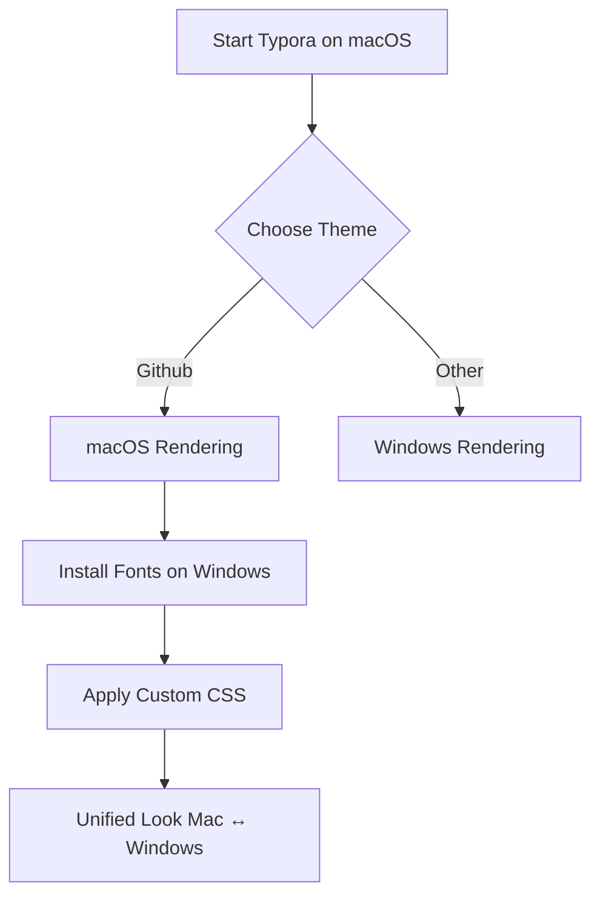

# 🌟 QUICK RECAP (copy to Typora)

| Mode              | Keywords                    |
| ----------------- | --------------------------- |
| Socratic          | *Socratic, ask don’t tell*  |
| Pair-programming  | *Follow along, next step*   |
| Debugging         | *Debug, spot error*         |
| Refactoring       | *Clean, elegant, optimize*  |
| Ternary           | *Ternary version, compress* |
| Exam mode         | *Exam, simulate test*       |
| Console-only      | *Enemy-machine version*     |
| Teacher-safe      | *Teacher-friendly*          |
| Syntax drills     | *Syntax discipline*         |
| Calm learning     | *Caterpillar mode*          |
| Extended training | *10 drills, batch*          |

###### ffjkkkkfW

| ff   | dah  |      |
| ---- | :--- | ---- |
|      | ba   |      |
|      |      |      |
|      |      |      |

<!-- Caterpillar Inox – 4 post-it row -->

<table style="width:100%; border-collapse:separate; border-spacing:16px 12px; margin:24px 0;">
  <tr> <!-- Post-it 1 -->
    <td style="width:25%; padding:0;">
      

        

          🟩 Task 1
        

        <ul style="margin:0 0 0 1.1em;padding:0;">
          <li>Check Git repo</li>
          <li>Review Typora sync</li>
          <li>Quick PLA note</li>
        </ul>
      

    </td>
    <!-- Post-it 2 -->
    <td style="width:25%; padding:0;">
      

        

          🟩 Task 2
        

        <ul style="margin:0 0 0 1.1em;padding:0;">
          <li>VM / Ubuntu checkpoint</li>
          <li>Node / NGINX note</li>
          <li>Network reminder</li>
        </ul>
      

    </td>
    <!-- Post-it 3 -->
    <td style="width:25%; padding:0;">
      

        

          🟩 Task 3
        

        <ul style="margin:0 0 0 1.1em;padding:0;">
          <li>PLA / JS drill</li>
          <li>DOM exercise note</li>
          <li>Error to revisit</li>
        </ul>
      

    </td>
    <!-- Post-it 4 -->
    <td style="width:25%; padding:0;">
      

        

          🟩 Task 4
        

        <ul style="margin:0 0 0 1.1em;padding:0;">
          <li>Typora / theme tweak</li>
          <li>Fonts sanity check</li>
          <li>Post-it inox done ✔</li>
        </ul>
      

    </td>
  </tr>
</table>
- [x] 
